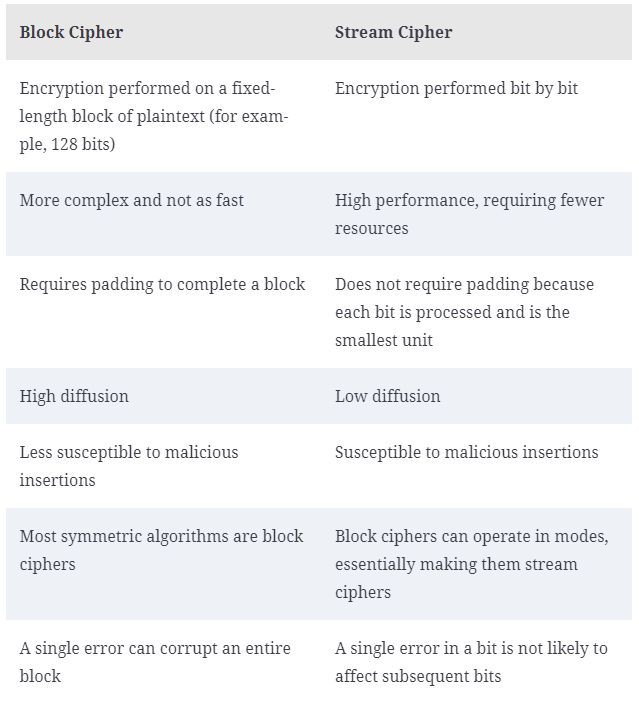
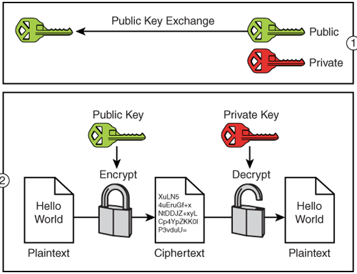

<!-- omit in toc -->
# Cryptographic Concepts

<!-- omit in toc -->
## Topics

- [Symmetric Algorithms](#symmetric-algorithms)
- [Asymmetric Algorithms](#asymmetric-algorithms)

## Symmetric Algorithms

- A system that uses a common shared key between the sender and receiver.
- **Advantages**
  - Easier to implement
  - Faster
- **Disadvantages**
  - Parties have to somehow exchange the key securely
- **Encryption Methods**
  - **Stream Cipher**
    - Plaintext bits are encrypted a single bit at a time
    - Fast and simple
  - **Block Cipher**
    - Plaintext is encrypted in blocks or chunks of fixed length

## Asymmetric Algorithms

- Asymmetric encryption algorithms have two keys: a public key and a private key
- **Public keys encrypt, and private keys decrypt**: Alice can encrypt a message with Bob's public key. Bob decrypts the message with his private key, which only he has
- **Private keys sign, and public keys verify signature**: Alice signs a message with her private key. Bob verifies the message's signature with Alice's public key

