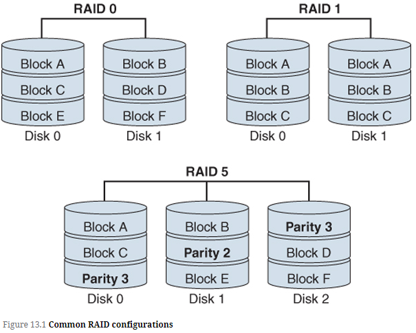

<!-- omit in toc -->
# Cybersecurity Resilience

<!-- omit in toc -->
## Topics

- [Load Balancers](#load-balancers)
- [RAID](#raid)
- [Backups](#backups)

## Load Balancers

- **Network load balancers**
  - Reverse proxy servers configured in a cluster to provide scalability and high availability
  - Network load balancing distributes the workload among multiple servers while providing a mechanism for server availability by health-checking each server.
  - From the client's perspective, the cluster seems to be a single server

- **Load balancing strategies**
  - Scheduling strategies are based on which tasks can be executed in parallel and where to execute these tasks.
  - **Round-robin**: Traffic is sent in a sequential, circular pattern to each node of a load balancer
  - **Random**: Traffic is sent to randomly selected nodes
  - **Least connections**: Traffic is sent to the node with the fewest open connection
  - **Weighted round-robin**: Traffic is sent to the node with the fewest open connection, based on the assigned weight number

## RAID

- **Redundant Array of Inexpensive Disks (RAID)**
  - Multiple disks are arranged as a large, high-performance logical disk to provide redundancy in case of disk failure
  - Allows for:
    - Higher data transfer rates on large data accesses
    - Higher I/O rates on small data accesses
    - Uniform load balancing across all the disks

- **Common RAID configurations**
  - **RAID 0**:
    - Data is broken into blocks and each block is written to a separate disk drive
    - Requires a minimum of two disks
  - **RAID 1**
    - Requires a minimum of two disks
    - Offers 100% redundancy because all of the data is written to both disks
    - Disk usage if 50%, the other 50% is used for redundancy
  - **RAID 2**
    - Each block of data is written to a disk
    - Requires the use of extra disks to store an error-correcting code
    - No commercial implementation of RAID 2 exist today because it is complicated and expensive with bad performance
  - **RAID 3**
    - Data block is striped and written on the data disks
    - Requires a minimum if three drives
    - Data is spread over the data disks, and a single parity disk is added to tolerate any single disk failure
  - **RAID 4**
    - Entire blocks are written onto a data disk
    - Requires a minimum of three drives
    - Similar to RAID 3 but data is spread across disks of arbitrary size instead of in bits
  - **RAID 5**
    - Each entire block of the data and the parity is striped
    - Requires a minimum of three disks
    - Writes both the data and the parity over all the disks and has the best small read/large write performance of any RAID array
  - **RAID 6**
    - An extension of RAID 5 that allows for additional fault tolerance by using two-dimensional parity
    - Can withstand the failure of up to two disks using the minimum of two redundant disk arrays
  - **RAID 10**
    - Combines RAID 1 and RAID 0
    - Requires a minimum of four disks
    - Disks are mirrored in pairs for redundancy and better performance
    - Data is also striped across multiple disks

## Backups

- **Full backup**
  - A complete backup of all data
  - This is the most time and resource intensive backup
  - If total loss of data happens, restoration from a complete backup is faster than other methods

- **Differential backup**
  - A backup that provides only the data that has changed since the last full backup, it doesn't matter if or when the last differential backup was made.
  - It is incomplete without the last full backup
  - Example: Server dies on Friday, you need the full backup from Monday and the differential from Wednesday

- **Incremental backup**
  - A backup that includes only the data that ahs changed since the last incremental backup.
  - It resets the archive bit
  - It is incomplete without a valid full backup and all incremental backups since the last full backup
  - Example: if the server dies on Thursday, you need the full backup from Monday and the incremental tapes from Tuesday and Wednesday
  - Requires the smallest amount of data storage and least amount of backup time but requires the most time for restoration

- **Snapshot**
  - A picture that preserves the entire state and data of a VM at a time it is taken
  - Includes the VM settings and the state of the VM's drives
