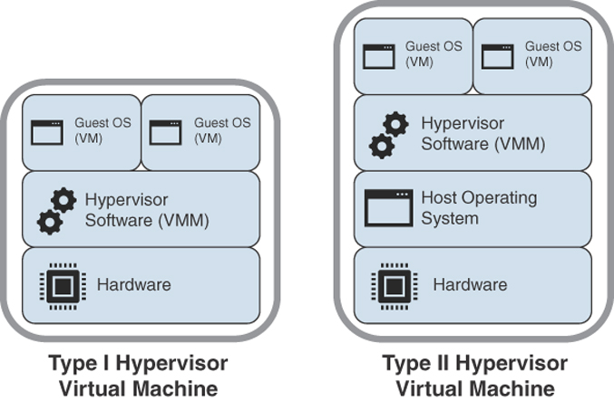
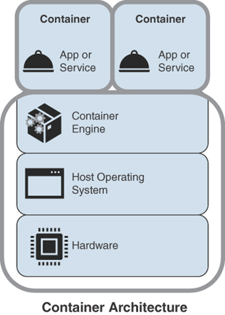

<!-- omit in toc -->
# Virtualization and Cloud Computing

<!-- omit in toc -->
## Topics

- [Virtualization](#virtualization)
  - [Containers and Microservices](#containers-and-microservices)
  - [Virtual Desktop Infrastructure (DVR)](#virtual-desktop-infrastructure-dvr)
  - [Virtual Machine (VM) Sprawl Avoidance](#virtual-machine-vm-sprawl-avoidance)
  - [VM Escape Protection](#vm-escape-protection)
  - [Software-Defined Networking (SDN)](#software-defined-networking-sdn)
  - [Infrastructure as Code (IaC)](#infrastructure-as-code-iac)
  - [Cloud Models](#cloud-models)

## Virtualization

- **Virtualization** - a technology developed to allow a guest operating system to run along with a host operating system with one set of hardware
  - Security concerns:
    - VM is compromised, then an intruder can gain control of all the guest operating systems
    - Hardware is shared, so virtual machines run with very high privileges
    - VMs need to be patched just like host environments
    - Be mindful of sharing files among guest and host operating systems
- **Hypervisors**
  - A ***hypervisor*** is a software or hardware-layer program that permits the use of many instances of an operating system or instances of different operating systems on the same machine, independent of each other.
  - **Hypervisor Types**
    - **Type I**
      - Native hypervisor or bare-metal hypervisor
      - Software that runs directly on a hardware platform
      - Guest OS runs at the second level above the hardware
      - Hypervisor translates all OS instructions on the fly and caches the results for future use, user-level instructions run unmodified at native speed.
      - Runs directly on the hardware, VM resources provided by the hypervisor.
      - Examples: VMWare ESXi, Citrix XenServer
    - **Type II**
      - Software that runs in an operating system environment where the guest operating system runs at the third level above the hardware
      - Hypervisor runs as an application or a shell on another OS that is already running
      - This VMs are entirely software and contain no hardware components
      - Example: VirtualBox, HyperV, VMWare server

    

### Containers and Microservices

- ***Containers***, unlike virtual machines, consists of only the application and its dependencies
  - They are then piled on top of a single operating system
  - Containers use an engine for OS emulation like Docker
  - They can easily move around and ensure applications or services will run, regardless of where they are deployed
  - Containers provide a way to package, deploy and run a program or process
  - Containers contain only applications and follow the minimal requirements to run an application in a container package
- **Benefits**
  - Automated testing and resilient
  - Rapid deployment and faster development
- **Downside**
  - Since they use the same OS host kernel, the underlying OS can be compromised if a user or an application has elevated privileges within the container
  - Quality assurance problems
  - If containers are not properly vetted, they can open us to malware infections
  
    

### Virtual Desktop Infrastructure (DVR)

- Similar to server virtualization but differences in usage and performance demands
- Often the most dynamic of all the virtualized environments because far more changes are made inside the environment (locally and over the network)
- Often includes software for managing the virtual desktops
- VDI is the server-based virtualization technology that hosts and manages virtual desktops
  - Functions:
    - Creating desktop images
    - Managing desktops on the servers
    - Provide client network access for the desktop
  - Requires high availability and storage capacity

### Virtual Machine (VM) Sprawl Avoidance

- **VM Sprawl**
  - Main drawback associated with virtual environments
  - Mainly associated with:
    - Servers
    - Multiple underutilized virtual servers
    - Can spread across multiple facilities in different geographic locations
  - Mainly happens because VMs are not included in the change/life cycle management processes
  - **Mitigations**
    - Follow change control processes
    - Enforce automatic deployment and configuration
    - Decommissioning, archiving, or delete VMs
    - Use management agents

### VM Escape Protection

- ***VM Escape***
  - Happens when the VM breaks out or escapes from isolation and becomes able to interact with the host OS
- **Mitigation**
  - Keep up to date on VM CVEs and apply patches
  - Contact cloud service provides to ask about patching

### Software-Defined Networking (SDN)

- Enables organizations to manage network services through a decoupled underlying infrastructure that allows for quick adjustments to changing requirements
- Software based rather than hardware based
- SDN layer sits between the applications and the infrastructure
- SDN architecture supports APIs that allow common network services and policy management
- Enables IT staff to manage their servers, applications, storage, and networks with a common approach and tool set

### Infrastructure as Code (IaC)

- Also known as ***programmable infrastructure***
- Enables infrastructure configuration to be incorporated into application code
- Enables DevOps teams to test applications in production-like environments from the beginning of the dev cycle
- Basically, all configurations are written into the script or code
- Automation Frameworks:
  - Chef
  - Puppet
- Tools
  - Ansible
  - Docker
- Benefits:
  - Acts as documentation reference point for the application infrastructure
  - Provides a consistent starting point for deployments
  - Supports infrastructure independence
  - Prevents infrastructure inconsistencies

### Cloud Models

- **Service models**
  - IaaS
  - PaaS
  - SaaS
- **Deployment Models**
  - Hybrid
  - Community
  - Private
  - Public
