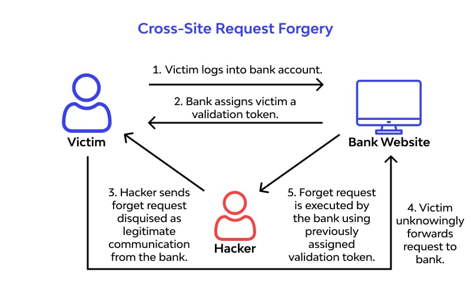
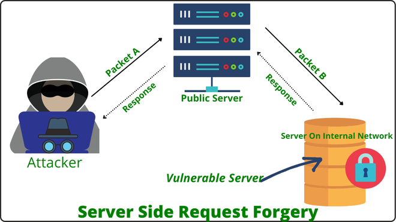
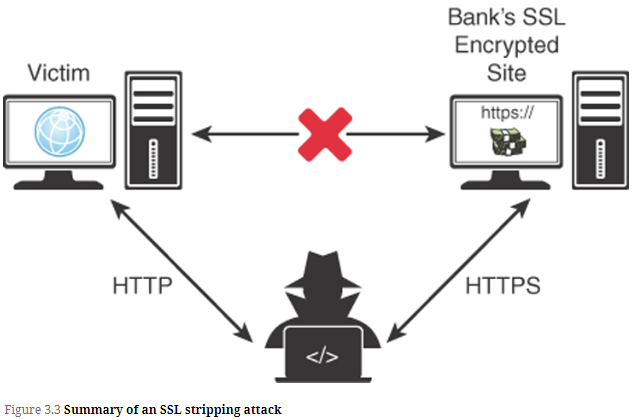

# Application Attacks

## Topics
- [Application Attacks](#application-attacks)
  - [Topics](#topics)
  - [Race Conditions](#race-conditions)
  - [Improper Software Handling](#improper-software-handling)
  - [Resource Exhaustion](#resource-exhaustion)
  - [Overflows](#overflows)
  - [Code Injections](#code-injections)
  - [Driver Manipulation](#driver-manipulation)
  - [Request Forgeries](#request-forgeries)
  - [Directory Traversal](#directory-traversal)
  - [Replay Attack](#replay-attack)
  - [Application Programming Interface (API) Attacks](#application-programming-interface-api-attacks)
  - [Pass the Hash attack](#pass-the-hash-attack)

## Race Conditions

- A ***race condition*** is simply a way in which a program executes a sequence of code (set of instructions).
  - Usually happens when sequences of instructions are competing for the same resources or trying to act at the same time

- **Race conditions** can cause the following:
  - Unexpected and undesirable results
  - Malfunction or system crash
  - Denial of Service
  - Exploitation of system processes to gain elevated access (privilege escalation)

## Improper Software Handling

- Software that is not able to properly handle inputs and errors can cause security impacts:
  - **Improper Input Handling**: can be used by an attacker to gain control of a system or inject code for remote execution.
  - **Improper Error Handling**: can result in release of messages and diagnostic information that is sensitive to inner workings of the system. This information can be valuable for attackers to advance an attack.

## Resource Exhaustion

- When software does not properly handle hardware resources (CPU, RAM, storage,etc) the system might completely consume or exhaust resources.
- This is essentially a denial of service and can impact access to the system along with data processing.
- This can also be caused by other attacks and unexpected events.

## Overflows

- **Buffer Overflows** cause disruption of service and lost data.
  - These happen when the amount of data sent to an application exceeds the storage space that was reserved in memory for the application (think of a bucket overflowing with water)
  - The application does not know how to handle the extra data and would become unstable
  - If the application was not designed to deal with this then this extra data can overwrite other portions of memory that is in use by other applications and can cause failures and crashes

- **Buffer Overflows** can have the following results:
  - Data or memory storage might be overwritten
  - Attack might overload the buffer's ability to handle the extra data and cause a denial of service
  - Attacker might be able to execute code, often at an elevated level.

- Two types of privilege escalations exist:
  - User can gain additional privileges after authenticating
  - Privilege escalation with no authentication

- Most effective way to prevent these is to keep software patched and updated and keep an eye out for new vulnerabilities

## Code Injections

- A ***buffer overflow*** could let an attacker execute code outside of the application
- Code Injection or execution can happen when an attacker can execute programs and/or commands on an attacked machine
- Exploits are designed to attack bugs in software that allows us to run these commands on the target machine
- ***Remote Code Execution (RCE)*** is worse, since this code or commands can run over networks and even the internet
- These attacks are prevented by proper input validation
- These attacks can cause modification or theft of data
- **Examples**
  - **Cross-site scripting (XSS)**
    - Attacker puts a malicious client-side script on a website, causing the browser to do things like:
      - unauthorized access activities
      - expose confidential data
      - log successful attacks back to the attacker
      - let the attacker hijack the user's session
      - cause the user to navigate to a malware infected site
      - unknowingly attack a site on behalf of the attacker (botnets)
  - **SQL Injection**
    - Malicious code is inserted into strings that are then sent to a database server on the backend
    - The database server executes this code, often results in exposure of sensitive database (usernames, passwords)
  - **LDAP Injection**
    - Malicious input is sent to a directory server
    - This can result in:
      - unauthorized queries
      - granting of permissions
      - password changes
  - **XML Injection**
    - Attacker manipulates the logic of an application to perform unauthorized activity or gained unauthorized access by inserting XML language into a message
  - **DLL Injection**
    - Inserts malicious code into a running process
    - Leverages **Dynamic Link Libraries (DLLs)**, which applications load at runtime
    - When this works, a legitimate process hooks into a malicious DLL and then runs them

## Driver Manipulation

- This as legitimate uses and can be done to improve performance, ensure compatibility, improve security
- This can also be used as an attack vector
- **Important Concepts**
  - **Shimming**
    - When device drivers are incompatible, a developer might write a "shim" which is just code that sits between the components and intercepts calls and makes them compatible.
    - This can be used by an attacker to intercept calls, make changes and even redirect the call
  - **Refactoring**
    - Refactoring reduces complexity of code and improves code extensibility
    - Malware can exploit poorly written code that is not refactored and look for vulnerabilities.
    - A skilled attacker can also refactor the code themselves and trick the system into using the manipulated driver
    - This is why it is important to verify trusted code (hashing) to ensure integrity of code and programs

## Request Forgeries

- These attacks take advantage of how web servers handle URLs
- **Cross-Site Request Forgery (CSRF or XSRF)**
  - Causes end users to run unwanted actions on a site they are already logged into
  - Attacker prepares a special URL that is started on the client side from a web browser
  - Then the attacker can send requests to a site you are already logged into (could be on another tab)

    
        Source: [Wallarm](https://www.wallarm.com/what/what-is-cross-site-request-forgery)

- **Server-Side Request Forgery (SSRF)**
  - Initiated from a web server through a vulnerable web application
  - User is tricked into doing something that helps the hacker
  - Goals are often:
    - compromising information from the web server
    - enabling other attacks
    - bypassing input validation
    - execution of commands
  - Proper input validation is key to preventing SSRF

    
        Source: [GeeksForGeeks](https://www.geeksforgeeks.org/server-side-request-forgery-ssrf-in-depth/)

## Directory Traversal

- This can expose system directories and files
- Can let the attacker access things like:
  - Source code
  - public directories and files
  - access to root directories (/etc/passwd)
  - access to sensitive files
  - command execution

## Replay Attack

- Packets are captured by using sniffers.
- Once the attacker gets the juicy information, the packets are placed back on the network
  - For example, a password replay attack
- Protections
  - timestamps on packets
  - Secure protocols (IPSec for example)

- **Session Replay**
  - A common replay attack against web applications
  - Web apps assign a ***sessionID*** (usually stored in cookies) that is good for the session
  - If the attacker gets their hands on the ***sessionID*** from the user they can pretend to be the authorized user within the application

- **Secure Sockets Layer (SSL) Stripping**
  - Here an attacker removes the encryption between the client and the website
  - Usually by acting as a proxy or middleman, the attacker can get a secure connection between themselves and the server
  - Countermeasures
    - HTTPS by default
    - HTTP Strict Transport Security (HSTS)

    
        Source: ExamCram

## Application Programming Interface (API) Attacks

- APIs expose application logic and make data available when needed by design
- Top 10 API risks according to OWASP
  - **Broken Object Level Authorization**
    - APIs tend to expose endpoints, creating a wide attack surface Level Access Control issue.
    - authorization checks should be done in every function that accesses a data source using an input from the user
  - **Broken User Authentication**
    - Authentication mechanisms implemented incorrectly
    - Attackers can compromise authentication tokens or exploit implementation flaws to hijack users' identities
  - **Excessive Data Exposure**
    - sometimes developers expose all object properties without considering sensitivity
  - **Lack of Resources and Rate Limiting**
    - APIs sometimes do not impose restrictions on the size or number of resources that can be requested by the client/user.
    - This can lead to DoS but also opens the door for authentication flaws like brute force
  - **Broken Function Level Authorization**
    - Complex access controls policies (groups, roles, unclear separation between admin and regular functions)
    - Attackers can exploit this to gain access to other users' resources and admin functions
  - **Mass Assignment**
    - Attackers can modify object properties that they are not supposed to
  - **Security Misconfiguration**
    - Unsecure default configurations, misconfigured HTTP headers, unnecessary HTTP methods, verbose error messages containing sensitive information
  - **Injection**
    - SQL, NoSQL, Command Injection
    - Attacker's malicious data can trick the interpreter into running commands or accessing data without authorization
  - **Improper Assets Management**
    - APIs expose more endpoints than traditional web apps
    - Deprecated API versions and exposed debug endpoints
  - **Insufficient Logging and Monitoring**
    - Let's attackers further attacks, maintain persistence, pivot to other systems and extract or destroy data.

## Pass the Hash attack

- Most passwords are stored as hashed values
- Here the attackers doesn't need to access the user's password but only needs the hashed value of the password
- This attack targets systems that use the NTLM (NT Lan Manager) or LM authentication scheme
- Once the attacker has the hash, they can pass it to the system for authentication