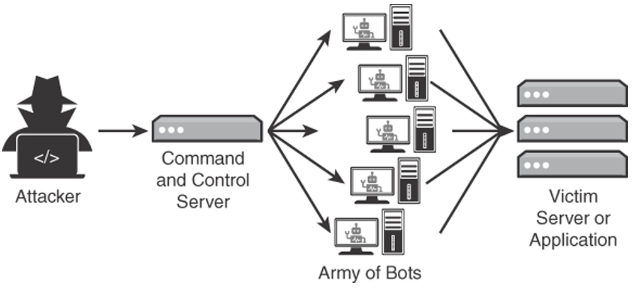

<!-- omit in toc -->
# Network Attacks

<!-- omit in toc -->
## Topics

- [Wireless](#wireless)
- [Short-Range Wireless Communications](#short-range-wireless-communications)
- [Layer 2 Attacks](#layer-2-attacks)
- [Domain Name System (DNS) Attacks](#domain-name-system-dns-attacks)
- [Denial of Service](#denial-of-service)
- [Malicious Code and Script Execution](#malicious-code-and-script-execution)

## Wireless

- Vulnerable to same attacks as wired networks
  - Man-in-the-middle
  - Denial of Service
  - Replay attacks
  - Crypto attacks
- Can also be disrupted by other radio sources
- **Rogue Access Point**
  - Unauthorized wireless access point is set up
- **Evil Twin**
  - An unauthorized wireless access point is set up to mount a man-in-the-middle attack
- **Dissociation or de-authentication attack**
  - Denial of service between wireless users and the wireless access point
  - By spoofing a MAC address, an attacker can send de-authentication data transmission to the access point
- **Initialization Vector (IV) attacks**
  - Attacks that use passive statistical analysis
  - An IV is an input to a cryptographic algorithm, a random number that should be unique and unpredictable
  - If the IV is too short, predictable or not unique then it can be subject to attacks

## Short-Range Wireless Communications

- **Bluetooth**
  - ***Bluejacking** - devices receive spam sent from nearby bluetooth devices, relatively harmless
  - ***Bluesnarfing*** - attack that can expose or change user's information by forcing a pairing with the attacker device

- **Near-Field Communication**
  - Set of standards for contactless communication between devices
  - Potential risks:
    - **Confidentiality** - open to eavesdropping, sensitive data must be encrypted
    - **Denial of service** - vulnerable to jamming and interference that cause loss of service
    - **Man-in-the-middle** - uncommon with NFC
    - **Malicious code** - malware prevention and user awareness are key controls

- **Radio Frequency Identification (RFID)**
  - A wireless technology that was initially common to supply-chain and inventory tracking
  - Uses electromagnetic fields and is one-way
  - Biggest concern is privacy
    - Even when RFID tags are encrypted, track movement of a tag or object to which a tag is applied to

- **Man-in-the-middle (On-path Attack)**
  - Attacker intercepts traffic and then tricks the parties at both ends into thinking they are communicating with each other
  - Possible because of the TCP three-way handshake
  - Protections
    - Encryption
    - Secure protocols
    - User session or device tracking

- **Man in the browser (MITB)**
  - A trojan that infects web browser components such as browser plug-ins and other browser objects
  - These attacks can avoid web application controls that might otherwise alert to MiTM attacks
  - Can also inject web code and do other actions to interact with the user

## Layer 2 Attacks

- Lower layers affect the layers above them. If layer 2 is compromised, layer 3 is also compromised

- **MAC Spoofing**
  - Provides false identification information to gain unauthorized access
  - Changes the built-in MAC address of a network device, this is hard-coded and assigned to each network interface from the factory
  - Can bypass access restrictions based on MAC addresses

- **ARP Poisoning**
  - ARP operates at Layer 2, it associates MAC addresses to IP addresses
  - Simple lower-layer protocol that consists of requests and replies without validation. This simplicity leads to a lack of security
  - ARP does not have any type of validation so attackers can trick a device into thinking any IP address is related to any MAC address
  - Limited to attacks that are locally based, attacker needs either physical access to the network or control of a device on the local network
  - **Mitigations**
    - Static or scrip-based mappings for IP addresses and ARP tables
    - Use of port security
    - Monitoring tools or IDS to alert when suspicious activity happens

- **MAC Flooding**
  - ARP poisoning can lead to MAC flooding
  - An attack that compromises a networking switch
  - Basically overwhelms that switch's ARP table and the device can no longer learn new information and becomes flooded
  - When this happens the switch starts acting like a hub and broadcasts all network traffic to every device

- **Port Stealing**
  - A man-in-the-middle attack that exploits the binding between a port and a MAC address
  - Attacker sends a lot of packets with the source IP address of the victim and the destination MAC address of the attacker
  - This applies to broadcast networks built using switches

## Domain Name System (DNS) Attacks

- **Domain Hijacking**
  - Happens when a domain is taken over
  - Can happen when the domain ownership expires or due to security issues
  - Once an attacker takes over they can:
    - post embarrassing or malicious content from the domain on the web
    - redirect the domain to another domain
    - attacker might even sell the domain to another party

- **URL Redirection**
  - Common technique that is often used for legitimate purposes but can also be abused
  - Attacker can give a malicious URL and redirect the user to it
  - **Preventions**
    - validating the input of URLs passed to make sure that all URLs passed use relative paths only
    - If you need to pass other sites the use whitelisting

- **DNS Poisoning**
  - Enables an attacker to redirect traffic by changing the IP record for a specific domain, sending legitimate traffic to anywhere they choose
  - Also called ***DNS cache poisoning*** - caches this information to distribute the attack's effect to the server users
  - The attacker delegates a false name to the domain server and provide a false address for the server
  - Results
    - DNS servers can be used for DDoS attacks
    - Malware can be downloaded from the rogue site
    - Future requests are redirected to the fake IP address
    - Build of an effective botnet
    - Allow for code injection exploits
  - Protections
    - Check DNS setup if you are hosting your own DNS
    - Check DNS is not open recursive (respond to any lookup request without checking where it originates)

- **Protections**
  - ***Domain Reputation***
    - reputation monitoring
      - includes IP monitoring
      - provides threat intelligence
      - protects against external malicious domains

## Denial of Service

- Purpose is to disrupt the resources or services that a user would expect to be able to access
- Executed by manipulating protocols
- Usually involves flooding a listening port on the target machine
- The goal is to overwhelm the system to the point that it cannot process legitimate service requests
- **Examples**
  - **Smurf/Smurfing**
    - Based on ICMP echo reply function
    - Attacker sends ping packets to the broadcast address of the network but changes the source address to be the IP of the intended victim.
    - This causes a flood of traffic to be sent to the victim machine
  - **Fraggle**
    - Similar to the smurf attack but uses UDP instead of ICMP
    - Attacker sends spoofed UDP packets to broadcast addresses just as in the smurf attack
  - **Ping flood**
    - Attempts to block service or reduce activity on a host by sending ping requests directly to the victim
    - Ping of death is a variation of this attack, the packet size is so large that the system does not know how to handle the packet
  - **SYN Flood**
    - Attacks that takes advantage of the TCP handshake
    - Source system sends a flood of SYN requests but does not send the final ACK, creating half-open TCP sessions
    - This overflows the target's connection buffer, making it impossible to service connection requests from other users
  - **Land**
    - Attacker exploits a behavior in the OS and their TCP/IP stacks
    - Attacker spoofs a TCP/IP SYN packet to the victim system with the same source and destination IP address and the same source and destination ports
    - This confuses the system when it tries to respond to the packet
  - **Teardrop**
    - Targets a known behavior of UDP in the TCP/IP stack of some operating systems
    - Attacker sends fragmented UDP packets to the victim with odd offset values in subsequent packets
    - When the OS tries to rebuild the original packets from the fragments, the fragments overwrite each other, causing confusion
    - When OSes can't handle this type of error, the system might crash or reboot

- **Distributed DoS**
  - Attacker creates a command and control server and create many zombies, forming a botnet
  - Software running on the zombies can launch all sorts of attacks, such as UDP or SYN floods on a target
  - Attacker distributes zombie software or infects multiple hosts, giving the attacker control of the infected systems
  - **Symptoms**
    - Report of slow response from applications and services
    - Applications and services are not available outside of known maintenance windows or other failures
    - Weird spikes in requests coming in a short period of time, many from the same IP address or range of addresses

    
    Source ExamCram

## Malicious Code and Script Execution

- Takes advantage of the power to create macro viruses
- Attackers can take advantage of this to run malicious commands
- **Common languages**
  - PowerShell
  - Python
  - Bash
  - Visual Basic for Applications (VBA)
