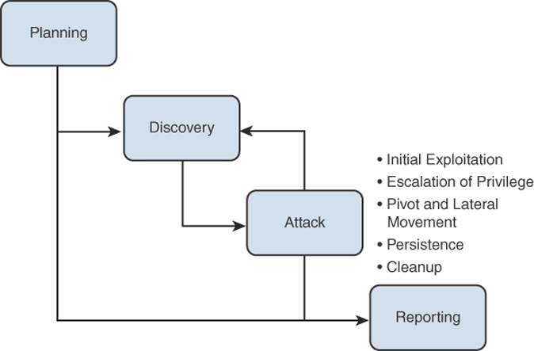
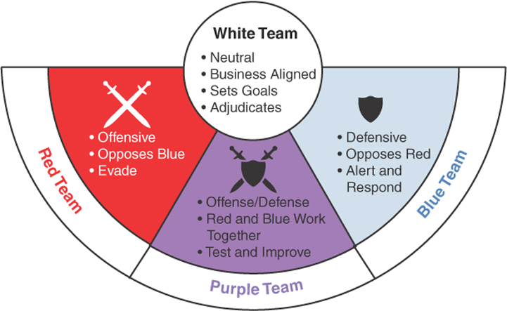

<!-- omit in toc -->
# Penetration Testing Techniques

<!-- omit in toc -->
## Topics

- [Testing Methodology](#testing-methodology)
  - [Pentesting Phases](#pentesting-phases)
- [Team Exercises](#team-exercises)

## Testing Methodology

- ***Pentesting***
  - Used as part of an organization's information security program to better understand the systems
  - Help identify areas of weakness that need to be strengthened
  - Can be conducted as one of the following:
    - **Black box (unknown environment)**
      - Assessor has no knowledge of the inner workings of the system or the source code
      - Easy way to think about this is imagine you cannot see through or inside a black box
    - **White box (known environment)**
      - Provides more transparency than black box testing.
      - Assessor has knowledge of the inner workings of either the system or the source code.
    - **Gray box (partially known environment)**
      - combines white and black box techniques
  - **Pentesting Components**
    - **Verifying that a threat exists**
      - Seeks to exploit vulnerabilities
      - Understand the threats and its extent
    - **Bypassing security controls**
      - Seek to bypass security controls, just as an attacker would
      - Can also be done by rendering security controls ineffective
    - **Actively testing security controls**
      - Direct interaction with a specific target
      - Try to identify if controls are implemented properly
    - **Exploiting Vulnerabilities**
      - Not only check for the existence of vulnerabilities but try to exploit them
      - Should lead to mitigation techniques and controls to deal with the security exposure

### Pentesting Phases

- **Planning**
  - Purpose is to set expectations and clarify the plan and goals
  - This is the time to clearly define the rules of engagement
    - How the testing will be conducted
    - Set expectations
    - How certain situations will be handled
  - Output should be a documented plan that includes rules and expectations
- **Discovery**
  - Two fundamental areas:
    - **Information gathering and scanning**
      - Involve conducting reconnaissance on the target through observation and discovery tools
      - Passive reconnaissance
        - ***Footprinting*** - process of gathering as much information as possible
      - Less risky than active ones because they do not require actively engaging with the target
      - Active reconnaissance
        - Requires engaging with a target
        - Examples: Port scanning and service identification
    - Vulnerability analysis
      - Databases of publicly vulnerabilities are available
      - Can be manually identified or use automated scanners

- **Attack**
  - Tester tries to gain access or penetrate the system as a result of exploiting an identified vulnerability
  - Attacker might have the opportunity to gain access at a higher authorization and conduct more advanced commands and routing (privilege escalation)
  - ***Lateral movement**
    - Tester tries to gain further access deeper into the network
    - Often involves pivoting through multiple systems and different directions to continue moving deeper
  - ***Persistence***
    - Tester might try to gain additional compromising information and install additional tools
    - Can also involve planting backdoors to allow continued remote access into the systems
- **Cleanup**
  - Attackers might want to remove any changes or signs left behind
  - This is important to ensure systems are back to the original state and that no new vulnerabilities have been introduced
- **Reporting**
  - A comprehensive report should be delivered that includes at a minimum:
    - Vulnerabilities identified
    - Actions taken and the results
    - Mitigation techniques
    - Quantification of risk

    
- ***Bug Bounty program***
  - Formalized program to identify the bugs that lead to a vulnerability or an exploit
  - Offered only on externally facing applications
  - Not performed on internal applications, unless the program is internal to employees
  - Provide continuous security testing
  - ***rules of engagement*** are critical and must be made very clear

## Team Exercises

- **Red Team Assessment**
  - Similar to a traditional penetration test but is more targeted
  - Might have a specific goal and usually lasts longer than a scoped-out pentest
  - Red team acts as the adversary, attacking and trying to stay unnoticed.
  - Blue team acts as defenders, they counter the red team and try to stop them from accomplishing their mission
  - Purple teaming
    - Red and blue teams work together to identify vulnerabilities, test controls, and explore ways to defeat and improve the controls
  - White team
    - Neutral team
    - Defines the goals and the rules
    - Drive the exercise through their knowledge and involvement across governance and compliance

    
